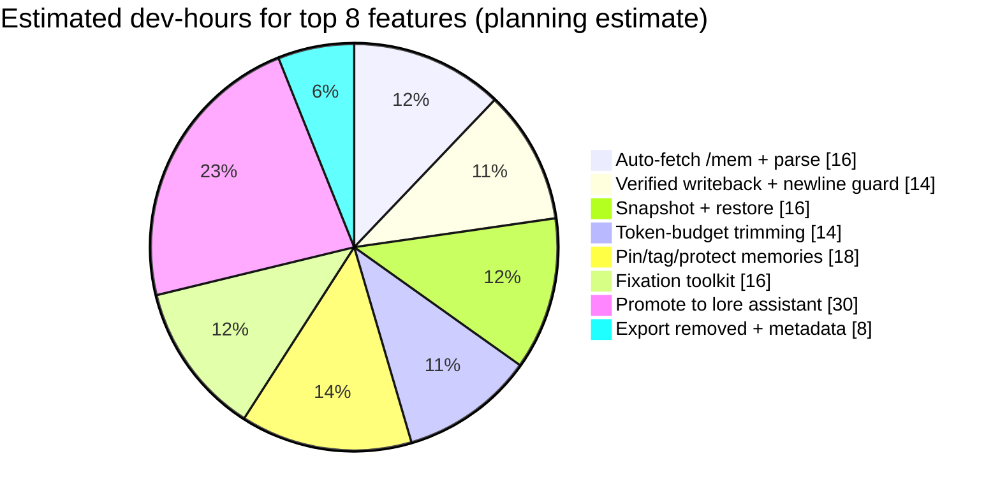
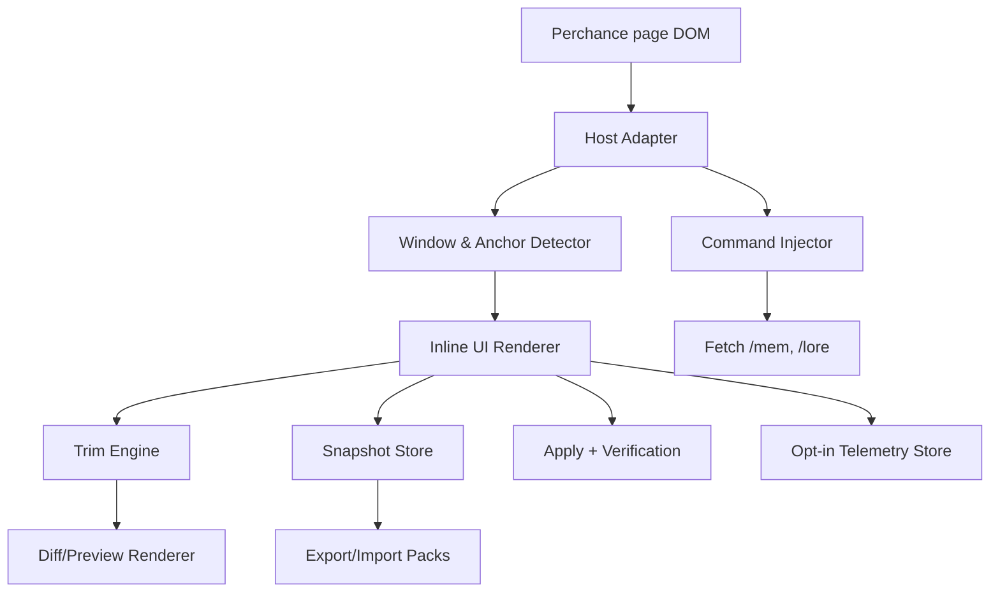
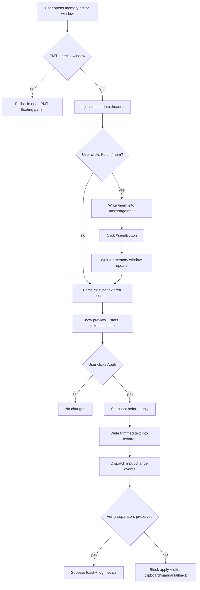

# Perchance Memory Trimmer Plugin Feature Research and Prioritized Improvement Plan

## Executive summary

Perchance users’ most visible pain points around memory management cluster into four recurring themes: (1) continuity in long, narrative threads (users want a reliable way to preserve key events when summaries roll forward and long‑term memory settings were missed), (2) performance and reliability at scale (slow responses, freezes, mobile data loss, and fragile export/import flows), (3) steering and debugging model behaviour (users want to identify and remove “garbage” memories/lore that cause fixation loops and to understand what memories/lore were used in a given reply), and (4) guidance and discoverability (new users frequently ask “how do I export?”, “how does memory work across threads?”, “how do /mem, /sum, /lore work?”, and “how do I keep the AI on track?”). citeturn1view2turn16view0turn15view1turn15view2turn15view3turn22view0

PMT already addresses the core “manual trimming” problem (dedup/keep newest/char limit, diff preview, undo, token estimate, settings persistence) but it still inherits significant user friction because the Perchance workflow often requires issuing `/mem`, copying text, pasting into a tool, copying output, and pasting back—plus it risks destructive edits (the “blank line disappearance” /mem edit bug) and lacks end‑to‑end “safety rails” (snapshots, verification, and “known-good restore”). citeturn1view1turn17view0

The highest-leverage next improvements—specifically to complement PMT’s inline integration—are therefore: (1) **automating capture + writeback** (one-click fetch/parse/apply with verification), (2) **token-budget guidance** (trim to a target budget and show savings), (3) **pin/tag/protect memories** (so users can preserve “turning points”), (4) **fixation tooling** (phrase/word overuse detector + optional blocklist suggestions), (5) **lore workflow assistance** (promote selected memories into lore and manage multi-character lore expectations), (6) **robust safety/backup** (snapshots, export of removed entries, and “restore last known good”), and (7) **mobile-friendly UI posture** (compact, non-intrusive controls plus a “panic export” mindset aligned to how Perchance itself mitigates corruption). citeturn1view2turn15view2turn15view0turn18view0turn18view1turn17view0turn22view0

## Research signals and source channels to prioritize

### What to prioritize and why

The following channel ordering maximizes “primary/official” signal first, while still capturing community demand (and the long-tail “workarounds” that PMT can productize):

**Primary / official-adjacent**
- Perchance developer and moderator guidance on the forum (hosted as a federated forum instance) is the fastest path to “what’s actually true” about storage, export/import, and failure modes (e.g., guidance on data corruption recovery and IndexedDB specifics). citeturn18view1turn18view0  
- The formal Perchance communities and their published “where to ask what” guidance help target the right user segment: the technical community versus the casual, AI-heavy community. citeturn8view0turn17view0turn9view0

**Community signals (high-volume, high UX signal)**
- The community Q&A threads repeat the same needs: export readability, memory thread scoping, editing summaries, debugging “what memories were used,” preserving important scenes, and addressing repetitive/fixated outputs. citeturn16view0turn1view2turn15view2turn15view0turn15view3

**Distribution / marketplace feedback loop**
- The PMT listing and stats on a userscript marketplace are a concrete adoption baseline and a natural place users will leave installation friction, compatibility complaints, and “feature request” comments. citeturn1view1turn21view0turn21view1

### Recommended channel triage order

1) **Perchance forum posts on reliability, persistence, export/import, and lore/memory bugs** (because they reveal structural constraints PMT must respect).  
2) **High-signal “how do I…” threads on continuity and workflow** (because they map directly to PMT UX improvements and safe automation).  
3) **Performance complaint threads** (because PMT’s central promise is “keep memory small → improve responsiveness,” and users explicitly complain about slowness). citeturn1view1turn15view3  
4) **Marketplace + GitHub issues for PMT itself** (because “what users ask for” quickly becomes actionable backlog items).

### Sources overview to monitor continuously

| Source type | What it’s best for | Strengths | Known limitations for research |
|---|---|---|---|
| Perchance official/community “forum” instance entity["organization","Lemmy.World","federated forum instance"] | Bugs, data loss recovery, lore/memory edge cases | High credibility and context | Some threads are technical and not representative of casual users citeturn18view1turn17view0turn8view0 |
| Casual Perchance community + “resources” hub | Quick UX pain points + where Discord support lives | Captures the heavy AI-chat user base; points to Discord & docs | Discord content itself is often not publicly indexable (see “unspecified” in Discord section) citeturn9view0turn15view2 |
| Perchance Discord entity["organization","Discord","chat platform"] | Real-time support, emergent workflow patterns | High velocity feedback | Invite is public but thread content is not reliably scrapable/searchable on the open web; specific channels are **unspecified** as public artefacts citeturn9view0turn15view2 |
| Subreddit entity["organization","Reddit","social news platform"] | Repeated “new user” questions; product gaps; performance complaints | High volume; strong UX signal | Advice can be inconsistent; not always technically accurate citeturn16view0turn15view3turn1view2 |
| Userscript marketplace entity["organization","Greasy Fork","userscript hosting site"] | Install friction; baseline adoption; reviews; simple support | Clear distribution channel; stats for lightweight KPIs | Low comment volume for niche scripts; no deep qualitative insight unless reviews appear citeturn1view1turn21view0turn21view1 |
| PMT repo issues on entity["company","GitHub","code hosting platform"] | Actionable engineering backlog | Structured triage and release notes | Only reflects users who file issues; may lag broader community needs (repo link referenced by user; public issue volume currently **unspecified**). |
| Character packs and “how to build characters” repos (ex: entity["company","Hugging Face","model hub and datasets"]) | Defaults and best practices for prompts/characters | Concrete templates to learn from | Not directly about memory, but influences what users store in memory/lore citeturn16view0 |

### Key user-demand themes surfaced by research

The strongest feature pressure (frequency + severity) comes from:

- **Continuity for long stories**: Users explicitly want a practical way to preserve “important scenes” after they fall out of the rolling summary/memory window, and they ask whether `/lore` or `/mem` is the “right” approach. citeturn1view2  
- **Export/import reliability and readability**: Users ask how to export readable text and note limitations (multi-character export not distinguishing speakers), and there are reports of export/import workflows breaking at scale or becoming unusably large due to cached embeddings being exported. citeturn16view0turn8view0turn8view1  
- **Debugging what the model used** (and fixing it): Multiple threads reference the “brain icon” that shows what lore/memories were used for a reply and suggest editing memories/summaries or reminders to prevent “tunnel vision.” citeturn16view0turn15view0turn15view2  
- **Performance and stability**: “AI character chat is very slow” appears regularly, and there are mobile-specific reports where the app freezes and returns to a default bot, implying local-storage/session fragility. citeturn15view3turn22view0  
- **Repetition / fixation**: Users want something closer to a “hard blocklist” or at least tooling to detect and remove reinforcement loops (words/phrases that dominate). citeturn15view2turn15view1  
- **Lore handling clarity in multi-character settings**: Users are confused about whether lore URLs load for invited characters and how lore/memories are selected (relevance scoring rather than random), and they want ways to ensure the “right facts” influence the “right character.” citeturn15view0turn16view0

image_group{"layout":"carousel","aspect_ratio":"16:9","query":["Perchance AI character chat interface screenshot","Perchance AI character chat memory window /mem screenshot","Perchance AI character chat lore editor screenshot","Perchance AI character chat brain icon memories used screenshot"],"num_per_query":1}

## Candidate feature backlog with prioritization and impact vs effort

### Categorized candidate feature list

Effort estimates assume a single primary developer familiar with PMT and Perchance’s DOM, and include design + implementation + basic testing (not full QA automation). Complexity reflects DOM fragility and edge-case surface area.

| Category | Candidate feature | Short description | User problem solved | Complexity | Effort (dev-hours) | Dependencies / risks | Priority |
|---|---|---|---|---:|---:|---|---|
| Integration | Auto-fetch `/mem` and parse | Button triggers `/mem`, waits for window, extracts memory text, loads into inline PMT editor | Removes copy/paste loop described in PMT instructions; reduces “I didn’t know /mem existed” friction | Med | 12–18 | DOM race conditions; different Perchance pages (`ai-chat` vs `ai-character-chat`) | High |
| Integration | Verified writeback to memory editor | One-click apply writes trimmed memory back into editor, dispatches input/change, verifies separation | Prevents destructive edits and reduces manual paste error | Med | 10–16 | Must handle `/mem` blank-line bug; clipboard fallback | High |
| Safety | Snapshot + restore + “last known good” | Automatic snapshot before apply; fast restore; export snapshots | Mitigates data loss & “oops I trimmed too much” | Med | 12–20 | Storage limits; sensitive content stored locally | High |
| Token management | Token-budget trimming | Trim to a target token count; show savings and warnings (before/after) | Users perceive strict context limits; want control and predictable “fit” | Med | 10–18 | Token counting accuracy varies by model; must message uncertainty clearly | High |
| UX | Pin/protect/tag memories | Users can mark entries as “Never remove”; tag as “scene / relationship / location” | Preserves “important scenes/turning points” over long stories | Med | 14–22 | Needs stable IDs for entries; requires UI affordance | High |
| Automation | Fixation toolkit (overuse detector + suggested removals) | Detect high-frequency phrases/entries; suggest trimming or moving to lore; optional “soft blocklist” helper | “Tunnel vision” loops; suggested “hard blocklist” desire | Med | 12–20 | False positives; user trust—must be opt-in & transparent | High |
| Lore handling | “Promote to lore” assistant | Select memories → format for `/lore`; assist with lore URL expectations; warn about invited character lore URLs | Multi-character lore confusion; workflow to preserve continuity | High | 22–40 | Perchance lore semantics and UI patterns may change; risk of mis-formatting | High |
| Analytics | “What was used?” overlay / inspector | Mirror “brain icon” concept: show which memory entries were used recently; annotate matches | Helps users diagnose and remove “garbage” memories | Med | 14–26 | Requires hooking into the UI that reveals used memories; may be brittle | Med–High |
| Export/import | Export removed entries and trimmed sets | One-click download: removed entries, kept entries, and metadata | Supports offline archiving and continuity | Low | 6–10 | File download permissions; formats | Medium |
| Export/import | Export optimizer warnings | Detect “export bloat risk” (large lore tables, embeddings) and warn; optionally offer a local “strip caches” export | Export/import breaking due to embedded vectors/embeddings | High | 30–60 | Deep integration with Perchance export internals; may not be feasible safely in userscript | Medium |
| Commands/presets | Preset profiles + quick actions | “RP Longform”, “Speed Mode”, “Keep 20”, etc; command palette | Lowers cognitive load; reduces repetitive setting changes | Low | 6–12 | Needs clear defaults; avoid surprising behaviour | Medium–High |
| UX | Compact “inline diff” improvements | More readable diff, collapse unchanged groups, jump to removed | Makes trimming safer at a glance (already a strong PMT feature) | Med | 10–18 | Diff library choice; performance on huge text | Medium |
| Accessibility | Keyboard-first workflow | Full shortcut map, focus management, ARIA labels, high-contrast support | Accessibility and speed for power users | Low–Med | 8–16 | Must avoid collisions with site shortcuts | Medium |
| Mobile | Mobile bottom-sheet mode | Minimal UI, large taps, avoids hover-only controls | Mobile freezes and resets; mobile needs safer UI patterns | Med | 14–24 | Userscript support differs on iOS; limited screen | Medium |
| Collaboration | Shareable “memory curation pack” | Export a bundle of pinned memories + lore suggestions as a file | Lets users transfer story continuity between devices/threads | Med | 14–24 | Privacy; format stability | Low–Med |
| Automation | Smart dedup (fuzzy) | Near-duplicate clustering (not exact duplicate) | Helps when AI repeats paraphrased memories | High | 20–35 | Risk of deleting distinct meaning; must be suggestion-first | Medium |
| Safety | “Dry run + guardrails” expansion | Warn if trim would delete all; warn if pinned would be removed; “undo stack” per thread | Prevents catastrophic trims | Low | 4–8 | Mostly UI | High |
| Integration | ShortcutButtonsCtn “mini controls” | Place minimal PMT buttons near existing shortcuts | Keeps PMT page-native and discoverable | Med | 10–16 | DOM anchor drift; responsive layout | Medium |

Key evidence tie-ins: PMT’s current workflow requires manual `/mem` + copy/paste loops. citeturn1view1 Export/import and corruption recovery are persistent concerns, especially on mobile and after crashes. citeturn22view0turn18view1turn18view0turn8view1 Lore/memory usage and debugging flows repeatedly reference the “brain icon,” `/sum`, `/mem`, and `/lore` as the levers users rely on. citeturn16view0turn15view0turn15view2

### Impact vs effort comparison table

The table below is meant to help pick “what to ship next” with an ROI lens (Impact reflects user pain severity + breadth of demand; Effort reflects the estimates above).

| Feature (short name) | Impact | Effort | Notes |
|---|---:|---:|---|
| Auto-fetch `/mem` | High | Med | Directly removes PMT’s main friction loop. citeturn1view1 |
| Verified writeback | High | Med | Counterbalances destructive “/mem save removes blank lines” bug risk. citeturn17view0 |
| Snapshot + restore | High | Med | Aligns with “export to recover from corruption” culture; builds trust. citeturn18view0turn18view1 |
| Token-budget trimming | High | Med | Addresses perceived context limits + speed; improves predictability. citeturn1view2turn15view3turn1view1 |
| Pin/tag memories | High | Med | Directly addresses “preserve key scenes” problem. citeturn1view2 |
| Fixation toolkit | High | Med | Repetition/tunnel-vision is a major qualitative pain point. citeturn15view2 |
| Promote to lore | High | High | Strong demand, but broader surface area and risk. citeturn1view2turn15view0turn16view0 |
| Export optimizer (strip embeddings) | Med–High | High | Clear technical issue, but likely requires deep hooks into Perchance export pipeline. citeturn8view0 |

Mermaid “chart” (estimated dev-hours for the top 8, for planning—not measured telemetry):

## Detailed specs for the top eight features

The specs below assume PMT is a userscript operating in a dynamic SPA, and that the plugin must **degrade gracefully** to PMT’s standalone floating panel whenever anchors don’t match.

### Feature A — Auto-fetch `/mem` and parse into inline PMT

**Behaviour**
- When user clicks **“Fetch /mem”**, PMT:
  1) snapshots current PMT session state (so user can cancel safely),
  2) writes `/mem` into `#messageInput`,
  3) clicks `#sendButton`,
  4) waits for a `.window` that looks like the memory editor to appear,
  5) extracts the memory text (textarea or `.body` content) and loads entries.

This is a direct automation of the manual workflow PMT currently documents: type `/mem`, copy, paste into PMT, trim, copy, paste back. citeturn1view1

**UI placement**
- In the inline toolbar injected into the memory editor window header (`.window .header`): `Fetch /mem`, `Re-fetch`, `Apply`, `Restore`, `Export`.
- Secondary placement (optional): small icon button in `#shortcutButtonsCtn` if present (discoverability).

**DOM hooks**
- Inputs/actions: `#messageInput`, `#sendButton` (to issue `/mem`).  
- Results detection: MutationObserver watching `document.body` for `.window` creation, then heuristic classification (“is memory window?”).

**Events to dispatch**
- After setting `#messageInput.value`, dispatch:
  - `input` (bubbles),
  - `change` (bubbles),
  - optionally `keydown` / `keyup` if the app relies on them (fallback only).

**Fallback behaviour**
- If `#messageInput` or `#sendButton` not found within 1s: show a small inline error and open the standalone PMT panel with instructions.
- If memory window not detected within N seconds: offer “open /mem manually” hint and switch to manual paste mode.

**Data model changes**
- Add `pmt.session.lastMemFetchAt`, `pmt.session.lastMemTextHash` (for “re-fetch changed?”).
- Add per-thread “mem source descriptor”: `{ source: 'auto'|'manual', detectedWindowId, detectedAt }`.

**Storage / backup strategy**
- Store only **hashes and counters** by default; store raw fetched text only in session memory unless the user enables snapshots (see Feature C).

**Security / privacy**
- No network calls.  
- If snapshots enabled: warn that memory text may include sensitive content and is stored locally.

### Feature B — Verified writeback to memory editor with newline-preservation guard

**Behaviour**
- On **Apply**, PMT:
  1) takes a snapshot (Feature C),
  2) writes the trimmed text back into the memory editor textarea,
  3) dispatches `input/change`,
  4) re-reads the textarea to confirm separators are preserved,
  5) if verification fails, it does **not** “save” automatically; instead it prompts the user with a safe fallback (“copy to clipboard” or “manual apply”).

This directly mitigates the reported “Memory New Line Disappearance” bug where saving `/mem` collapses blank lines and squishes entries together. citeturn17view0

**UI placement**
- Primary: inline toolbar in the memory window header.
- Secondary: keyboard shortcut (e.g., Ctrl+Enter) scoped only when memory window is focused.

**DOM hooks**
- Memory editor textarea (heuristic):
  - First try: `.window .body textarea` within the detected memory window.
  - Otherwise: contenteditable or input patterns inside `.window .body`.

**Events to dispatch**
- `input` & `change` on the textarea.
- Optional: dispatch a custom event `pmt:mem-changed` on `window` (namespaced) for internal listeners.

**Verification heuristic**
- After writeback, parse entries again and ensure:
  - entry count matches expected,
  - separators exist (e.g., at least one blank line between entries) OR user chose “single newline mode.”
- If Perchance collapses blank lines, PMT offers an opt-in workaround: “use a spacer line” (e.g., a single space or a visible delimiter) and documents that this may affect how memory is interpreted.

**Fallback behaviour**
- If textarea not found, fall back to:
  - copy-to-clipboard output (already aligned with current PMT behaviour) citeturn1view1
  - show “paste into /mem window manually.”

**Data model changes**
- Track last applied hash, last verification result, and failure reasons.

**Security / privacy**
- No network calls.
- Clipboard fallback must be explicit (user action) due to browser permissions and user trust.

### Feature C — Snapshot + restore + “last known good” (trust rails)

**Behaviour**
- Every Apply creates a snapshot:
  - timestamp,
  - before text,
  - after text,
  - trim config,
  - derived stats: tokens estimate, removed count.
- Restore options:
  - “Undo” (last snapshot),
  - “Pick snapshot” (history),
  - “Export snapshots” (JSON for user vault).

This aligns with the broader Perchance ecosystem’s emphasis on exporting data during failures and keeping backups when dealing with corruption or crashes. citeturn18view0turn18view1turn8view1

**UI placement**
- Inline “Restore” dropdown button.
- A compact “History” modal from the toolbar.

**DOM hooks**
- None required beyond PMT UI.

**Fallback behaviour**
- If localStorage quota errors occur, PMT:
  - keeps at least one recent snapshot in memory,
  - prompts user to export snapshots and clear history.

**Data model**
- `pmt.history[memScopeId] = [ Snapshot ]`, capped by count and/or bytes.
- `memScopeId` heuristic:
  - Prefer Perchance thread ID if detectable (unspecified; depends on DOM),
  - Else computed from URL + selected thread name + active character name (best-effort).

**Storage / backup**
- Default: keep last 20 snapshots; cap total stored snapshot bytes.
- Snapshot exports are local file downloads.

**Security / privacy**
- Explicit disclosure: snapshots may include story content; stored locally.
- “Clear all PMT data” controls must be prominent.

### Feature D — Token-budget trimming mode

**Behaviour**
- Add a “Target tokens” mode:
  - user selects a budget (e.g., 1,000; 2,000; 4,000; “max”),
  - PMT suggests trims until estimated tokens are under budget.
- Displays:
  - before/after token estimate,
  - percentage removed,
  - “risk flags” (e.g., budget too low → likely continuity loss).

Tokens/context limits are repeatedly referenced by users as the reason chat “forgets” older events, and users explicitly struggle with continuity once content falls outside the summary window. citeturn15view1turn1view2

**UI placement**
- In memory window toolbar: a compact “Budget” dropdown that opens a small inline settings popover.

**DOM hooks**
- None beyond reading/writing memory textarea.

**Dependencies / risks**
- Accurate tokenization depends on the underlying model; PMT should label counts as “estimate” unless it can access an official counter (the page code you provided suggests Perchance exposes token counting functions, but this is based on uploaded code rather than an externally accessible doc, so treat it as best-effort).

**Fallback behaviour**
- If token counter not available: default to a conservative heuristic (e.g., chars/4 similar to PMT v2.01). citeturn1view1

**Data model**
- Add `cfg.tokenBudgetMode`, `cfg.targetTokens`, `cfg.tokenEstimator = 'heuristic'|'native'`.

**Privacy**
- Token counting remains local.

### Feature E — Pin/protect/tag memories

**Behaviour**
- Each memory entry gains:
  - a pin toggle (“protect”),
  - quick tag (scene / character / relationship / world / misc),
  - optional note.
- Trimming rules:
  - pinned entries are excluded from deletion unless user explicitly overrides (“Allow removing pinned”).

This directly addresses “preserve important scenes in long chats” and “turning points” continuity concerns. citeturn1view2

**UI placement**
- Inline list view shows entries with:
  - left-side pin icon,
  - tag chip,
  - collapse/expand for long entries.
- A “Pinned only” filter.

**DOM hooks**
- None required; applies to PMT rendering.

**Fallback behaviour**
- If entry count is huge, render a virtualized list (optional). If not implemented, fall back to search-only + basic list to avoid UI lag.

**Data model**
- Need stable per-entry IDs:
  - default ID = hash(normalized entry text),
  - with collision-safe suffix if duplicates.
- Store per-thread pin metadata separately from the raw text export.

**Storage**
- Store pins/tags as metadata maps: `metaByEntryId`.

**Security / privacy**
- Tags/notes are sensitive; local-only; export requires explicit user action.

### Feature F — Fixation toolkit (overuse detector + “soft blocklist” helper)

**Behaviour**
- PMT analyses:
  - top repeated phrases across memory entries,
  - memory entries frequently containing overused phrases.
- UI actions:
  - “Show likely fixation drivers”
  - “Suggest removals” (never auto-delete by default)
  - “Add to blocklist helper”: insert user-facing “Reminder” text suggestion to discourage phrases (not guaranteed).

Users explicitly describe tunnel vision and repetition (romance fixation, single-goal fixation) and another user calls for a “hard blocklist feature.” PMT can’t force the model to never say a word, but it can (a) remove reinforcement signals from memory and (b) help craft reminders. citeturn15view2turn15view1

**UI placement**
- Tab: “Fixation” inside PMT inline memory window panel.
- Compact banner: “You have highly repetitive tokens/phrases in memory” (click to inspect).

**DOM hooks**
- Optionally read “Reminder Message” UI field if it’s present in DOM (unspecified; depends on current Perchance UI).

**Data model**
- Store blocklist helper list and last run stats.

**Risks**
- False positives; must be suggestion-forward and reversible.
- User trust: never silently alter reminders.

**Privacy**
- Phrase extraction is local.

### Feature G — Lore assistant (promote to /lore + multi-character expectations)

**Behaviour**
- “Promote to lore” flow:
  - user selects pinned memories or individual entries,
  - PMT formats into lore-friendly blocks (title + bullet facts),
  - user picks target: “thread lore” or “character lorebook workflow” (if URLs exist).
- Multi-character guidance:
  - show a warning: lore URLs in invited characters may be ignored (as reported), so users should centralize shared lore explicitly. citeturn15view0

This directly solves the “how do I preserve important scenes?” and “how does lore apply across threads/characters?” questions. citeturn1view2turn16view0turn15view0

**UI placement**
- Button: “Send to Lore…” in the inline toolbar.
- A modal that previews the exact `/lore` payload and offers “Copy / Paste” and “Auto-send /lore” options.

**DOM hooks**
- To auto-send: `#messageInput` and `#sendButton` (type `/lore` and then paste content).
- Detect lore window for verification (similar heuristics to memory window).

**Events**
- Same input/change dispatch pattern on message input.

**Fallback behaviour**
- If auto-send fails, provide copy-to-clipboard payload and manual instruction.

**Risks**
- Lore selection is relevance-scored (not random) according to community explanations, so lore quality matters; PMT should encourage concise, searchable phrasing. citeturn15view0

**Storage**
- Store lore drafts in local snapshots until applied.

**Privacy**
- Lore content can be sensitive; never send anywhere.

### Feature H — Export removed entries + curation pack

**Behaviour**
- One-click exports:
  - `pmt-mem-kept.txt`,
  - `pmt-mem-removed.txt`,
  - `pmt-mem-snapshots.json`,
  - optionally `pmt-curation-pack.json` (pins, tags, configs).

This complements the recurring user desire for readable exports and story continuity management. citeturn16view0turn1view2

**UI placement**
- “Export” dropdown in toolbar.

**Fallback behaviour**
- If downloads blocked, show plaintext in a modal for manual copy.

**Data model**
- Export format should be versioned: `schemaVersion`, `createdAt`, `scopeId`.

**Security / privacy**
- Include warning: exported files may contain adult or sensitive content; user controls destination.

## Roadmap, QA/testing plan, and opt-in metrics/telemetry

### Incremental roadmap

Dates are relative to the current date (2026-03-31) and assume part-time iteration; adjust if you’re dedicating full-time capacity.

**Milestone 1 — “Friction killer + safety rails” (target: 2–3 weeks)**
- Scope:
  - Auto-fetch `/mem` (Feature A)
  - Verified writeback + newline guard (Feature B)
  - Snapshot + restore (Feature C)
  - Expanded dry-run guardrails (warn if removes all, etc.)
- Acceptance criteria:
  - One-click “Fetch /mem” reliably loads entries in >90% of sessions on `ai-character-chat`.
  - Apply always creates snapshot; restore returns exact pre-apply text.
  - On newline verification failure, PMT blocks destructive apply and offers safe fallback.
- Rationale:
  - This directly eliminates the manual loop described in PMT’s own documentation and addresses the known `/mem` newline bug risk. citeturn1view1turn17view0

**Milestone 2 — “Control and continuity” (target: +3–4 weeks)**
- Scope:
  - Token-budget trimming (Feature D)
  - Pin/tag/protect memories (Feature E)
  - Export removed entries + curation pack (Feature H)
- Acceptance criteria:
  - Users can pin entries and confirm trims never remove pinned unless override is enabled.
  - Token-budget mode provides consistent before/after stats and never blocks manual trim mode.
  - Export bundles are readable and re-importable into PMT without loss.

**Milestone 3 — “Steering and lore workflow” (target: +4–6 weeks)**
- Scope:
  - Fixation toolkit (Feature F)
  - Lore assistant (Feature G)
  - Optional “what was used” inspector (stretch; depends on DOM hooks)
- Acceptance criteria:
  - Fixation view flags repeated phrase clusters and allows safe removal suggestions.
  - Lore assistant produces a clean payload and can auto-send `/lore` in at least one supported Perchance UI variant.
  - Documentation: clear disclaimers about model behaviour and limits.

### Testing and QA plan

**Unit tests (logic)**
- Entry parsing/normalization (blank line delimiters, trailing spaces).
- Dedup exact and fuzzy (if implemented).
- Token estimator correctness on known fixtures.
- Snapshot history capping and restore fidelity.
- Fixation detector reproducibility (same input → same flagged results).

**Integration tests (DOM harness)**
- Simulate pages with anchors: `#messageInput`, `#sendButton`, `.window .header .body`, `.message`, etc.
- MutationObserver-based detection:
  - window appears late,
  - multiple `.window` instances,
  - unexpected ordering.
- Verify event dispatch triggers expected “reactive” states (input value updates, UI enabling/disabling).

**Manual UX tests**
- “Happy path”:
  - open chat → fetch `/mem` → trim → apply → verify → restore.
- “Failure paths”:
  - memory window not detected,
  - clipboard blocked,
  - storage quota full,
  - Perchance lag / slow response scenarios.

**Cross-device / cross-browser**
- Desktop: Chromium, Firefox (users frequently mention both in export issues). citeturn8view0turn8view1  
- Mobile:
  - Android Chrome (touch interactions, bottom sheet),
  - iOS Safari via a userscript runner (behaviour depends on the runner; the marketplace lists iOS user script managers but compatibility is variable). citeturn1view1turn22view0

### Recommended opt-in metrics and telemetry

Given user trust concerns (and the sensitivity of chat content), telemetry should be:
- **Off by default**
- **Local-only by default**
- Exportable as a small JSON summary the user can choose to share in an issue.

Recommended metrics (aggregated counts only, no content):
- Sessions:
  - `tool_opened_count`, `inline_toolbar_shown_count`
- Core actions:
  - `mem_fetch_attempts`, `mem_fetch_successes`, `mem_apply_attempts`, `mem_apply_successes`, `restore_uses`, `undo_uses`
- Effectiveness:
  - `chars_removed_total`, `entries_removed_total`, `estimated_tokens_removed_total`, `estimated_token_savings_pct_avg`
- Reliability:
  - `newline_verification_failures`
  - `dom_anchor_missing_errors` (by anchor)
  - `clipboard_write_failures`
  - `mutation_observer_timeouts`
- Performance:
  - elapsed time for fetch/parse/apply (ms, bucketed)

User-facing reporting:
- A “Stats” panel inside PMT showing “You’ve saved ~X tokens across Y trims” (estimate) and “Restores used: Z.”

## Pitfalls, mitigations, DOM anchor playbook, and library recommendations

### Prioritized pitfalls and mitigation strategies

**DOM fragility and UI drift**
- Risk: selectors change, multiple Perchance pages exist (`ai-chat` vs `ai-character-chat`) and may implement different DOM. citeturn15view3  
- Mitigation:
  - Layered detection: prefer stable IDs; then fallback to semantic heuristics (button labels, textarea placeholders, window header text).
  - Feature flags: if confidence in detection < threshold, disable automation buttons and show manual mode.

**Race conditions in dynamic page**
- Risk: `/mem` window appears asynchronously; mutation observer could misclassify windows.  
- Mitigation:
  - Use a state machine with timeouts.
  - Require “window stable for 250ms” before parsing.
  - Never auto-apply after fetch; always require deliberate user click.

**/mem “blank line disappearance” bug**
- Risk: applying text might be “correct” but saving collapses separators, changing semantics. citeturn17view0  
- Mitigation:
  - Verification step (Feature B).
  - Offer alternate separator mode; document tradeoffs.
  - Always create snapshot before apply.

**Export/import instability and huge exports**
- Risk: heavy users hit export crashes, and lore exports can bloat due to embedding caches, making recovery hard. citeturn8view0turn8view1  
- Mitigation:
  - PMT cannot safely rewrite Perchance’s export pipeline without high fragility, but it can:
    - encourage frequent lightweight exports of **memory/lore only** (PMT curation packs),
    - warn users when lore/memory volumes indicate “high risk of export bloat,”
    - provide “recovery checklist” linking to official guidance patterns (export, test import in incognito, etc.). citeturn18view0turn18view1

**User trust / privacy expectations**
- Risk: users will assume PMT could exfiltrate content.  
- Mitigation:
  - Prominent privacy statement: “local-only, no network.”
  - Opt-in telemetry with local-only default and explicit export.
  - One-click “wipe PMT data.”

**Permission/clipboard issues**
- Risk: clipboard APIs can fail or require gesture. citeturn1view1  
- Mitigation:
  - Use the existing PMT fallback clipboard approach (as described in its feature list).
  - Always offer manual selection + copy area.

### DOM anchors and heuristics playbook (based on provided IDs/classes)

You requested the following anchor set; below is an implementation-minded prioritization and detection strategy.

**High-confidence primary anchors**
- `#messageInput`: command injection point (`/mem`, `/lore`, `/sum`) and user message text.
- `#sendButton`: safest “send” trigger (click rather than synthetic keypress).
- `#messageFeed`: message list container; useful for observing new message bubbles and potential “brain icon” affordances.
- `.message`: message bubble nodes; useful for hover tools or annotations.
- `.window`: floating editor windows (memory/lore/config).
- `.window .header`: best place for inline PMT toolbar injection without disturbing content.
- `.window .body`: where memory/lore textarea or text lives.

**Secondary anchors**
- `#shortcutButtonsCtn`: good for low-profile quick actions (open PMT, fetch mem, apply).
- `#threadOptionsButton`: potential “current thread” context; useful for scoping snapshots/pins.

**Heuristics for memory-window detection**
1) Candidate window must match `.window` and contain a `.header` and `.body`.
2) Prefer windows whose header text contains tokens like “mem”, “memory”, “memories” (case-insensitive).
3) If header text unavailable, look for `.body textarea` whose current value contains blank-line-separated entries (multiple paragraphs), and/or includes patterns common to memories (frequent past-tense summaries).
4) Confidence scoring:
   - header match: +0.6
   - textarea present: +0.2
   - text parses into ≥3 entries: +0.2  
   Enable “Apply” only if confidence ≥0.7.

**Heuristics for lore-window detection**
- Similar, but look for “lore” in header, and/or very large text blocks, and/or URL fields in body (if present).

**Heuristics for “wrong page” warning**
- AutoModerator explicitly notes different Perchance AI chat pages with different functions (`ai-chat` vs `ai-character-chat`). PMT should detect page variant via URL patterns and present a small banner when unsupported. citeturn15view3

### Architecture diagram and inline trim workflow

High-level architecture (userscript perspective):

Inline trim workflow (happy + fallback path):

### Recommended open-source libraries / algorithms to reuse (and why)

For a userscript, the best dependency strategy is “small, auditable, and locally bundled,” because external CDN links can become a supply-chain risk. Where a dependency is warranted:

**Diff rendering**
- Google’s diff-match-patch (robust diff/match/patch algorithms) is a well-known baseline for text diffs. citeturn11search0  
- `jsdiff` is popular and supports text differencing implementations; however, be mindful of security advisories affecting patch parsing in some versions (relevant if you ever parse patch format, not just render diffs). citeturn11search1turn11search25

**Fuzzy dedup / similarity**
- `fastest-levenshtein` is a lightweight option for edit distance. citeturn11search7  
- `fast-levenshtein` wraps efficient implementations and is commonly used, but still treat performance costs carefully on large memory sets. citeturn11search3

**Token counting**
- If you need model-accurate token counting for OpenAI tokenizers, consider `@dqbd/tiktoken` (JS/WASM bindings). citeturn11search18  
- In PMT’s Perchance context, prefer:
  1) Perchance-native token counters if exposed in-page (best UX alignment; based on uploaded page code, this appears plausible but is not externally documented in the scraped sources), else
  2) a conservative heuristic (chars/4, already aligned with PMT v2.01’s “rough token estimate”). citeturn1view1

**Small algorithms worth implementing directly (no deps)**
- Entry hashing: SHA‑256 via Web Crypto for stable entry IDs (for pin/tag tracking) (no external dependency).
- Frequency analysis: simple n‑gram counts for fixation toolkit (fast and explainable).
- “Relevance hinting”: highlight overlaps between user text and memory entries (string includes + tokenization), as a lightweight complement to the “brain icon” workflow users already reference. citeturn15view0turn16view0