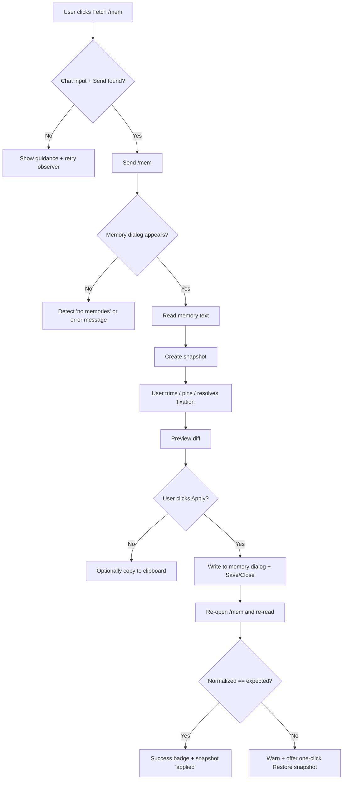

# Improving a userscript for memory management

## Executive summary

Your current script (v2.01.6b) already has a solid foundation: a SPA-safe injection guard, a draggable/resizable panel, live stats (including a rough token estimate), persistent settings/positions via `localStorage`, an undo stack, and a themes system that supports dark/light/custom CSS. citeturn9view0turn13search0 The next step is to make it “Perchance-native” by adding a reliable integration layer that can (a) auto-fetch `/mem`, (b) apply changes back to Perchance with verification and rollback, and (c) manage a real “memory workspace” (snapshots, pinned/protected entries, token-budget trimming, and fixation detection).

The most important Perchance-specific constraints to design around are:

- **Memory editing semantics:** Users can edit memories freely, but Perchance expects entries separated by blank lines. citeturn6reddit37  
- **Scope:** Memories are widely reported as **thread-specific**, not character-global. citeturn7reddit35  
- **Underlying storage reality:** Perchance’s AI Character Chat stores data in **IndexedDB** (community reports explicitly reference an IndexedDB database called `chatbot-ui-v1` and a global `db` object accessible from DevTools). citeturn15view1turn14search2  

Given those constraints, the recommended architecture is:

- **DOM-first integration for safety:** Use UI automation to open `/mem`, read the memory textarea, and write back through the same UI controls. This is least likely to corrupt underlying data across Perchance updates.
- **Optional “internal API” read-only enhancements:** Detect whether Perchance exposes objects like `db` or `oc` (mentioned in community technical posts) and use them to improve fidelity (e.g., retrieving context/diagnostics), but avoid direct DB writes unless you’re prepared to track Perchance schema changes. citeturn8view0turn15view1  
- **Verified apply workflow:** Always snapshot before apply; after apply, re-open `/mem` and compare normalized text to confirm, else offer one-click restore.

For token budgeting, keep the current “~4 chars per token” heuristic as the default baseline (fast, offline), but add an option to load a real tokenizer in-browser for accuracy (e.g., a pure JS BPE implementation compatible with OpenAI encodings). citeturn0search0turn16search2turn16search1

For accessibility and a Perchance-matching UI, migrate to a CSS-variable theme system and align modal/dialog behaviour (Esc close, focus management, `aria-modal`, labelled title). citeturn20search8turn20search0

## Perchance integration and hooks

### Behavioural hooks that matter

Perchance AI Character Chat users commonly interact with memory/summaries/lore through slash commands. A community guide and user discussions reinforce:

- `/mem` opens the “memory window”. citeturn6search0turn6reddit37  
- `/sum` opens the summaries window. citeturn6search0turn7search9  
- `/lore` opens lore; `/lore <entry>` can add lore entries. citeturn6search0turn6reddit37  

The “brain icon” feature (used to inspect which memories/lore/summaries/messages were used for a bot response) is referenced in community resources; this is useful for optional “context diagnostics” and for validating whether memory trimming actually changes retrieval behaviour. citeturn7search4turn7search9

### Integration strategy: DOM-first, with optional internal detection

Because Perchance is a SPA and its HTML is substantially JS-rendered, the most robust approach is:

- **DOM-first:** Automate the same user actions your script already documents (“type /mem”, Send, copy/paste). citeturn13search0turn6reddit37  
- **Optional internal API detection:** Some community technical posts show the presence of objects like `oc` (with `oc.thread.on("MessageAdded", ...)`) and a message-to-memories resolver (`oc.getMemories()` calling into parent window code that accesses `db.messages`, `db.memories`, `db.lore`). citeturn8view0  
- **Avoid direct writes to IndexedDB initially:** Perchance’s memory storage approach appears to have changed over time (community code references both “old memory storage” via numeric IDs and a “new approach” via `messageId|level|index` references). That volatility makes direct writes risky unless you version-gate by schema probing. citeturn8view0  

### DOM integration checklist and selector strategy

Because Perchance may change CSS classes, prefer a **selector cascade**: stable IDs → ARIA labels/titles → semantic structure.

Checklist for the integration layer:

- Confirm you are on the intended page(s): `location.pathname.startsWith("/ai-character-chat")`.
- Use a “host readiness” observer: wait for chat input area to exist before enabling auto-fetch.
- Implement a selector cascade per element with runtime logging (“found via selector X”).

Recommended robust selectors (expressed as ordered fallbacks):

| Target | Primary | Secondary | Tertiary heuristic | Validation |
|---|---|---|---|---|
| Chat message input | `#messageInput` (if present) | `textarea[placeholder*="message" i]` | “largest visible textarea near bottom” | `el instanceof HTMLTextAreaElement && el.offsetParent` |
| Send button | `#sendButton` | `button[aria-label*="send" i], button[title*="send" i]` | button next to input with SVG icon | `!btn.disabled && btn.offsetParent` |
| Slash command dispatch | set input value + click Send | dispatch `keydown` Enter | (avoid) calling internal functions | verify message list updates or modal opens |
| Memory window container | `[role="dialog"]` containing “Memory/Memories” text | `div:has(textarea)` with close button | recently-added overlay/top-layer element | verify it includes an editable textarea |
| Memory textarea | `textarea` within memory dialog | `div[contenteditable="true"]` (if used) | focusable multiline editor | verify it contains blank-line separated entries after normalization |

Notes:

- Your script already includes a MutationObserver “reinject guard” pattern for SPA navigation. Reuse that approach to keep the Perchance integration bindings alive. citeturn9view0  
- If you decide to move away from `@grant none`, review Tampermonkey sandbox/injection implications. Tampermonkey documentation explicitly states that `@grant none` disables the sandbox, and it also documents the newer `@sandbox` directive for choosing MAIN/ISOLATED/USERSCRIPT contexts (important if Perchance uses CSP constraints). citeturn17search0  

### Command-response handling

Your automation should expect at least three observable outcomes after sending `/mem`:

- A memory editor window appears (success).
- A message indicates memories are unavailable/not enabled yet (common user report includes a “No memories yet…” style message). citeturn6reddit37  
- Perchance is in an error state or export/import overlay mode (rare but real; Perchance dev discussions reference failure-to-load states where export tools appear). citeturn15view1  

Handle those as explicit states in your flowchart (later section).

## Safe writeback and verification design

### Why “verified apply” matters

User reports emphasize that formatting and separators are significant—memories are separated by blank lines and users are told to preserve that structure. citeturn6reddit37turn6search0 In addition, community guides mention formatting issues where entries can appear without line breaks; regardless of root cause, you should treat line separation as a fragile invariant and verify it after writing. citeturn6search0

### Writeback strategy hierarchy

Use a layered approach, from safest to most aggressive:

- **Preferred:** Write directly into the `/mem` textarea and trigger the same save/apply mechanism Perchance expects (e.g., clicking a save/close button in the dialog).
- **Fallback:** If the “save” mechanism is unclear, at minimum write the text and instruct the user to click the dialog’s Save/Close (semi-automated).
- **Clipboard fallback:** If programmatic apply fails, copy the trimmed text to clipboard and provide a guided “paste into memory box” flow (your current script already uses Clipboard API + legacy fallback). citeturn9view0turn18search2turn18search0  

Clipboard notes grounded in web platform constraints:

- `navigator.clipboard.writeText()` is only available in secure contexts and can throw `NotAllowedError` if disallowed. citeturn18search2turn18search15  
- `document.execCommand("copy")` is deprecated and not guaranteed long-term, but remains a compatibility fallback in many contexts. citeturn18search0turn18search15  

### Separator verification and normalization

Before applying, compute and persist:

- `rawBefore` (exact textarea string)
- `normBefore` (canonical form)
- `hashBefore` (fast hash of `normBefore`)
- `entryCountBefore`, `maxEntryLenBefore`, `tokenEstimateBefore`

Canonicalization recommended:

- Convert `\r\n` → `\n`
- Trim trailing spaces per line (optional; keep off by default to avoid unintentional diffs)
- Ensure exactly one blank line between entries when serializing
- Ensure file ends with a single newline (optional; user-configurable)

After applying and re-fetching `/mem`, compute `normAfter` and compare.

### Algorithms/pseudocode: verified apply/writeback

```js
function normalizeMemText(raw) {
  const s = raw.replace(/\r\n/g, "\n");
  // Keep internal spaces; normalize separators only:
  const entries = s.split(/\n{2,}/g).map(x => x.trim()).filter(Boolean);
  return entries.join("\n\n") + "\n";
}

async function verifiedApply({openMem, readMem, writeMem, closeMem, reopenMem}) {
  // 1) snapshot
  const rawBefore = await readMem();
  const normBefore = normalizeMemText(rawBefore);
  saveSnapshot({raw: rawBefore, norm: normBefore, ts: Date.now()});

  // 2) prepare outgoing content
  const outgoing = buildTrimmedAndSerialized(); // must join with "\n\n"

  // 3) preflight: never apply an empty set unless user explicitly confirms
  if (!outgoing.trim()) throw new Error("Refusing to apply empty memory.");

  // 4) write
  await writeMem(outgoing);

  // 5) close/save in Perchance UI
  await closeMem(); // clicks the dialog’s save/close, or triggers equivalent

  // 6) verify by re-fetching /mem
  await reopenMem();
  const rawAfter = await readMem();
  const normAfter = normalizeMemText(rawAfter);

  if (normAfter !== normalizeMemText(outgoing)) {
    // Verification failed: offer auto-restore
    return { ok: false, rawBefore, rawAfter, normAfter };
  }

  return { ok: true, rawBefore, rawAfter };
}
```

Key design choice: verification compares **normalized** content, not raw bytes, to avoid false negatives from Perchance reformatting (line endings, trailing newline behaviour).

## Snapshots, pinned entries, and persistence

### Storage option comparison

Your script currently stores configuration and window positions in `localStorage` (via JSON encode/decode with try/catch). citeturn9view0 Expanding to snapshots, pinned metadata, and per-thread history is feasible in `localStorage` if you enforce retention and keep payloads small.

Relevant platform constraints and tools:

- Web Storage (localStorage/sessionStorage) is synchronous and has tight quotas; MDN’s storage quota guidance notes Web Storage is limited (commonly 10 MiB total per origin, split across local and session in some browsers). citeturn19search11turn19search4  
- You can estimate storage usage/quota via `navigator.storage.estimate()` (useful for deciding snapshot retention dynamically). citeturn19search0  
- Tampermonkey offers `GM_setValue` / `GM_getValue` for per-script storage, but enabling it changes your sandbox model unless you remain in `@grant none`. citeturn0search4turn17search0  

| Storage mechanism | Pros | Cons | Best use here |
|---|---|---|---|
| `localStorage` | Simple, zero grants, same-origin with Perchance; already used in your script citeturn9view0 | Synchronous; quota-limited; can be cleared; large snapshots can overflow citeturn19search11turn19search4 | Default for snapshots + pins (with retention + size checks) |
| Tampermonkey `GM_setValue` | Script-scoped; often more resilient; avoids Perchance-origin collisions citeturn0search4turn17search0 | Requires grants; may change sandbox/injection; migration complexity | Optional “pro mode” persistence |
| IndexedDB (your own DB) | Large capacity; structured queries | More code; async; schema versioning | Optional if you want long-term snapshot archives |
| Perchance’s own IndexedDB | Already contains the truth (`chatbot-ui-v1`); global `db` often available in DevTools citeturn15view1 | Risky to write; schema changes; potential corruption | Read-only enhancement (auto-detect) |

### Snapshot strategy and retention policy

A “snapshot” should represent:

- the memory text at a point in time
- how it was derived (trim settings, input source)
- enough metadata to restore safely

Recommended retention policy:

- Maintain **per-thread** snapshot rings (e.g., last 20)
- Additionally keep **named snapshots** (user-starred) that don’t expire
- Add a global storage budget (e.g., 2–4 MiB of snapshots) and evict oldest unstarred first when approaching quota (optionally consult `navigator.storage.estimate()`). citeturn19search0turn19search11  

### Data schema for snapshots and pinned/protected entries

Prefer JSON, versioned, and designed for forward compatibility.

#### Snapshot record

```json
{
  "schemaVersion": 1,
  "id": "snap_2026-03-31T21:44:12.123Z_ab12cd",
  "threadKey": "thread:<perchanceThreadIdOrUrlHash>",
  "createdAt": "2026-03-31T21:44:12.123Z",
  "label": "Before token trim",
  "starred": false,

  "source": {
    "mode": "mem",
    "fetchedVia": "dom",
    "perchanceBuildHint": "unknown"
  },

  "stats": {
    "entries": 63,
    "chars": 18240,
    "tokenEstimate": 4560
  },

  "content": {
    "raw": "…exact textarea text…",
    "normalized": "…canonical \\n\\n-separated…"
  },

  "tool": {
    "scriptVersion": "2.01.6b",
    "trimConfig": {
      "strategy": "token_budget",
      "tokenBudget": 3000,
      "pinnedPolicy": "protect",
      "dedup": true
    }
  }
}
```

Notes:

- Keep both `raw` and `normalized` so you can restore exactly what the user had, while still supporting robust comparisons and diffs.
- `threadKey` should be derived from Perchance’s thread identity. If you can’t access a stable thread ID, hash `(location.href + selectedCharacterId + threadTitle)`.

#### Pinned/protected entry record

Pinning should be stable across edits. The safest identity is content-hash-based, with optional user override.

```json
{
  "schemaVersion": 1,
  "threadKey": "thread:<...>",
  "pins": [
    {
      "entryId": "h_fnv1a_9f2c1d0a",
      "label": "Core premise",
      "createdAt": "2026-03-31T21:50:00.000Z",
      "match": {
        "type": "normalized_hash",
        "hash": "9f2c1d0a",
        "fallbackContains": ["elisa", "damon"]
      },
      "policy": "protect"
    }
  ]
}
```

When trimming:

- If a pinned entry is present, it cannot be removed.
- If a pinned entry is missing (because Perchance changed it), surface a “pin mismatch” warning and offer to re-pin based on closest match.

### Privacy and security considerations

- **Never send memory content to third parties by default.** Users may store sensitive personal data in `/mem` and `/sum`.  
- If you add an optional real tokenizer loaded from a CDN, treat that as a supply-chain risk; Tampermonkey documentation highlights Subresource Integrity (SRI) support for external resources included via `@require`/`@resource`, which can help mitigate tampering. citeturn17search0  
- If you switch away from `@grant none`, be deliberate: Tampermonkey documents that `@grant none` disables the sandbox; changing grants changes execution context and may affect access to page variables and CSP interactions. citeturn17search0  

## Trimming, token budgeting, and fixation detection algorithms

### Token estimation options

Your current estimate `ceil(chars / 4)` matches OpenAI’s published rule of thumb for English (“1 token ≈ 4 characters”). citeturn0search0turn9view0 This is a good default because it is fast, offline, and predictable.

Add two optional accuracy tiers:

- **Heuristic+ (still offline):** word+punctuation model (e.g., `tokens ≈ words*1.3 + punctuation*0.5`) as a configurable alternative. Community posts discuss token inflation and attempts to correct it with word-based heuristics, but treat these as best-effort rather than authoritative. citeturn1reddit24turn1search4  
- **Exact tokenizer (preferred “pro” mode):** Use a browser-capable BPE tokenizer compatible with OpenAI encodings. For example, `gpt-tokenizer` advertises browser support, OpenAI model encodings (including `cl100k_base` and `o200k_base`), and UMD builds on unpkg. citeturn16search2  
  - The underlying reference implementation is OpenAI’s `tiktoken`, which is a BPE tokenizer for OpenAI models. citeturn16search1  

### Trimming strategy comparison

| Strategy | What it optimizes | Failure modes | Where it fits |
|---|---|---|---|
| Character cap per entry | Prevents “giant memories” from bloating context; easy to explain | Can delete a single crucial but long entry | Good first-pass filter; already present in your script citeturn9view0turn13search0 |
| Token-budget (global) | Matches model/context constraints; stable performance | Needs tokenizer estimate; can remove many small entries unexpectedly | Best “primary” strategy once token counting exists |
| Newest-N entries | Keeps recent coherence; predictable | Older “facts” may vanish; pinned policy needed | Good as fallback or user option; already present citeturn9view0 |
| Deduplicate | Removes repeated noise | Might remove intentional repetition; needs visibility | Good default-on with review, especially with fixation detection |
| Pinned-protect | Preserves crucial facts | Can prevent trimming from meeting budget | Must combine with “over-budget warning” and manual resolution |

### Pseudocode: token-budget trimming with pinned protection

```js
function splitEntries(raw) {
  return raw.replace(/\r\n/g, "\n")
    .split(/\n{2,}/g).map(s => s.trim()).filter(Boolean);
}

function serializeEntries(entries) {
  return entries.map(e => e.trim()).filter(Boolean).join("\n\n") + "\n";
}

function estimateTokens(text, mode) {
  if (mode === "chars4") return Math.ceil(text.length / 4); // baseline citeturn0search0
  if (mode === "exact") return tokenizer.encode(text).length; // optional
  return Math.ceil(text.length / 4);
}

function trimToTokenBudget(entries, {
  tokenBudget,
  pinnedSet,         // Set(entryId)
  entryIdFn,         // (entry) => id
  tokenMode = "chars4",
  order = "oldest_first" // remove oldest first by default
}) {
  // Keep pinned entries always.
  const ids = entries.map(e => entryIdFn(e));
  const pinnedMask = ids.map(id => pinnedSet.has(id));

  // Compute per-entry token estimates for greedy removal
  const entryTokens = entries.map(e => estimateTokens(e, tokenMode) + 2); // +2 for separators overhead

  let total = entryTokens.reduce((a,b) => a+b, 0);
  if (total <= tokenBudget) return { kept: entries, removed: [], total };

  // Candidate indices (non-pinned), in removal order
  const idx = entries.map((_, i) => i).filter(i => !pinnedMask[i]);
  const candidates = (order === "oldest_first") ? idx : idx.reverse();

  const removed = [];
  const keptMask = entries.map(() => true);

  for (const i of candidates) {
    if (total <= tokenBudget) break;
    keptMask[i] = false;
    total -= entryTokens[i];
    removed.push(entries[i]);
  }

  const kept = entries.filter((_, i) => keptMask[i]);

  return {
    kept,
    removed,
    total,
    overBudgetStill: total > tokenBudget, // happens if pins alone exceed budget
  };
}
```

User-facing behaviour when pinned entries exceed budget:

- Show a “Pins exceed budget” warning and a breakdown of token cost by pin.
- Offer: increase budget, unpin some entries, or switch to character-based trimming on pinned entries (explicit opt-in).

### Fixation detection heuristics

Fixation in this context usually manifests as:

- repeated phrases and templates across many entries
- runaway self-reinforcement (similar sentences reiterated with minor changes)
- duplicate or near-duplicate entries accumulating

A practical detector for your tool should be fast, offline, and explainable. Suggested multi-signal approach:

- **Exact duplicate rate**: `dupCount / entryCount`
- **Near-duplicate similarity**: Jaccard similarity of token sets or cosine similarity via hashed n-grams
- **n-gram repetition**: count repeated 3–6 word sequences across entries

Pseudocode sketch:

```js
function normalizeForNgrams(s) {
  return s.toLowerCase()
    .replace(/[\u2019’]/g, "'")
    .replace(/[^a-z0-9'\s]/g, " ")
    .replace(/\s+/g, " ")
    .trim();
}

function ngrams(words, n) {
  const out = [];
  for (let i = 0; i + n <= words.length; i++) out.push(words.slice(i, i+n).join(" "));
  return out;
}

function fixationScan(entries, {
  n = 4,
  minCount = 5,
  minAffectedEntries = 3
}) {
  const gramCounts = new Map();
  const gramToEntries = new Map();

  entries.forEach((e, idx) => {
    const w = normalizeForNgrams(e).split(" ").filter(Boolean);
    const grams = new Set(ngrams(w, n)); // set per entry to avoid intra-entry spam
    for (const g of grams) {
      gramCounts.set(g, (gramCounts.get(g) || 0) + 1);
      if (!gramToEntries.has(g)) gramToEntries.set(g, []);
      gramToEntries.get(g).push(idx);
    }
  });

  const hotspots = [];
  for (const [g, c] of gramCounts.entries()) {
    const affected = gramToEntries.get(g) || [];
    if (c >= minCount && new Set(affected).size >= minAffectedEntries) {
      hotspots.push({ gram: g, count: c, affectedEntries: affected });
    }
  }

  hotspots.sort((a,b) => b.count - a.count);
  return hotspots.slice(0, 50);
}
```

How to use in UI:

- Show “Fixation warnings” tab with top repeated n-grams and which entries they occur in.
- Provide one-click actions:
  - “Deduplicate exact”
  - “Merge similar” (semi-automatic: suggest merges but require confirmation)
  - “Pin exceptions” (user can pin the one canonical entry and remove the rest)

## UI/UX modernization and Perchance-aligned theming

image_group{"layout":"carousel","aspect_ratio":"16:9","query":["Perchance AI character chat interface screenshot","Perchance AI character chat memory window screenshot","Perchance dark theme UI screenshot"],"num_per_query":1}

### UI mockup suggestions

Keep the mental model: **Workspace = what’s currently in Perchance**, **Draft = your edited/trimmed version**.

Suggested layout (single panel, responsive):

- Header: “Memory Workspace” + thread indicator + status badge (Connected / Not found / Needs /mem)
- Tabs: Workspace | Draft | Diff | Pins | Fixation | Snapshots | Settings
- Footer action strip:
  - “Fetch /mem”
  - “Trim (preview)”
  - “Apply to Perchance”
  - “Restore snapshot”
  - “Copy”

Focus on reducing user error:

- Always show **entry count**, **chars**, **token estimate**, and **pinned count** in a sticky stats bar.
- In Diff tab, visually separate:
  - kept entries
  - removed entries
  - pinned entries (distinct style)

### Theme variables and CSS snippet architecture

Move from “override stylesheet” themes to a variable-driven system:

- Base component CSS uses variables only.
- Themes set variables on a root scope like `#pmt5-panel, #pmt5-fab`.

Core variable set (example):

```css
/* Base tokens */
#pmt5-panel, #pmt5-fab {
  --pmt-font: ui-sans-serif, system-ui, -apple-system, "Segoe UI", Arial, sans-serif;
  --pmt-radius: 10px;
  --pmt-space-1: 6px;
  --pmt-space-2: 10px;
  --pmt-space-3: 14px;

  --pmt-bg: #0f1115;
  --pmt-surface: #151a22;
  --pmt-surface-2: #1b2230;
  --pmt-text: #e6edf3;
  --pmt-text-muted: #9aa6b2;
  --pmt-border: rgba(255,255,255,0.10);

  --pmt-accent: #36c2a3;
  --pmt-accent-2: #5aa7ff;
  --pmt-danger: #f85149;
  --pmt-warn: #d29922;

  --pmt-focus: 0 0 0 3px rgba(90,167,255,0.35);
  --pmt-shadow: 0 10px 40px rgba(0,0,0,0.45);
}
```

Component usage example:

```css
#pmt5-panel {
  font-family: var(--pmt-font);
  background: var(--pmt-surface);
  color: var(--pmt-text);
  border: 1px solid var(--pmt-border);
  border-radius: var(--pmt-radius);
  box-shadow: var(--pmt-shadow);
}
#pmt5-panel button:focus-visible {
  outline: none;
  box-shadow: var(--pmt-focus);
}
```

### Two example themes

#### Perchance-matching light

```css
/* Light theme */
#pmt5-panel, #pmt5-fab {
  --pmt-bg: #f6f7fb;
  --pmt-surface: #ffffff;
  --pmt-surface-2: #f0f3f8;
  --pmt-text: #1b2430;
  --pmt-text-muted: #5b6b7c;
  --pmt-border: rgba(27,36,48,0.14);

  --pmt-accent: #1aa987;
  --pmt-accent-2: #2f7cf6;
  --pmt-danger: #d1242f;
  --pmt-warn: #b58100;

  --pmt-shadow: 0 12px 36px rgba(16,24,40,0.18);
  --pmt-focus: 0 0 0 3px rgba(47,124,246,0.30);
}
```

#### Perchance-matching dark

```css
/* Dark theme */
#pmt5-panel, #pmt5-fab {
  --pmt-bg: #0b0e14;
  --pmt-surface: #101522;
  --pmt-surface-2: #151c2b;
  --pmt-text: #e8eef5;
  --pmt-text-muted: #a1adbb;
  --pmt-border: rgba(232,238,245,0.10);

  --pmt-accent: #2bd3ad;
  --pmt-accent-2: #66aaff;
  --pmt-danger: #ff5d5d;
  --pmt-warn: #f0b429;

  --pmt-shadow: 0 14px 44px rgba(0,0,0,0.55);
  --pmt-focus: 0 0 0 3px rgba(102,170,255,0.35);
}
```

### Accessibility and interaction requirements

To align with established accessibility patterns:

- Use `role="dialog"` and `aria-modal="true"` for modal behaviour, with a labelled title (`aria-labelledby`) and Esc to close. citeturn20search8turn9view0  
- Ensure text contrast meets WCAG guidance (commonly 4.5:1 for normal text). citeturn20search0turn20search7  
- Add keyboard navigation:
  - Tab order that stays inside the dialog when modal
  - `Ctrl+Enter` (already present) plus discoverable hints
  - Hotkey for Fetch/Apply (configurable)
- Provide “reduced motion” support:
  - disable transitions when `prefers-reduced-motion: reduce`

## Implementation plan, milestones, and testing

### Prioritized milestones with effort estimates

Estimates assume you are already comfortable with your codebase and that Perchance DOM discovery is an iterative process in-browser.

| Milestone | Scope | Key outputs | Est. effort |
|---|---|---|---:|
| Integration adapter | Selector cascade + state machine + “Fetch /mem” automation | Reliable auto-fetch into textarea, robust error states | 10–16 h |
| Apply and verification | Apply into Perchance UI + post-apply re-fetch verify + auto-restore | “Apply” button that is safe by default | 12–20 h |
| Snapshot system | Snapshot schema + retention + UI + restore flow | Named snapshots, ring buffer, export/import snapshots | 10–18 h |
| Pinned/protected entries | Pin UX + matching + protected trimming | pins tab + “pins exceed budget” warning | 10–16 h |
| Token-budget trimming | Token budget UI + greedy algorithm + per-entry token stats | token cap trimming + per-entry cost view | 8–14 h |
| Optional exact tokenizer | Optional loading + fallback to heuristic | accurate token count mode toggle | 6–12 h |
| Fixation detector | n-gram + duplicate signals + UI warnings + actions | fixation tab + dedup/merge suggestions | 10–18 h |
| Theme refactor | CSS-variable tokens + light/dark + custom overrides | consistent Perchance-like styling + a11y | 8–14 h |
| Test harness and edge passes | Manual + scripted checks | checklist coverage + regression notes | 8–14 h |

### Mermaid flowchart for the user flow



### Testing checklist and edge cases

Core functional tests:

- Fetch `/mem` works when:
  - memories exist
  - memories are disabled/unavailable (“no memories yet” style) citeturn6reddit37
  - Perchance is in a partial-failure state (export overlay, slow load) citeturn15view1  
- Apply verification:
  - apply succeeds and normalized text matches
  - apply fails (dialog closed early, Perchance rejects) and restore snapshot returns to original
- Separator integrity:
  - entries remain separated by blank lines after apply citeturn6reddit37  
- Thread scoping:
  - switching threads uses a different snapshot/pin namespace (memories are thread-specific per user reports) citeturn7reddit35  

Algorithmic tests:

- Token budget:
  - pinned entries preserved
  - over-budget pins produce warning and block auto-apply unless user confirms
- Dedup:
  - duplicates removed; diff displays removed entries
- Fixation:
  - repeated phrase injected across entries triggers detection
  - normal repeated nouns do not over-trigger (tune thresholds)

Storage tests:

- Snapshot retention:
  - oldest snapshots evicted when budget exceeded
  - `localStorage` quota errors handled gracefully (no crash) citeturn19search11turn9view0  
- Optional: show storage usage/quota if `navigator.storage.estimate()` exists citeturn19search0  

Clipboard tests:

- `navigator.clipboard.writeText` success and failure paths (secure-context requirement and `NotAllowedError`) citeturn18search2  
- legacy fallback with `execCommand("copy")` still works where available (but treat as best-effort due to deprecation) citeturn18search0  

UI/a11y tests:

- Dialog focus trap; Esc closes; buttons accessible and labelled (ARIA modal dialog guidance) citeturn20search8turn9view0  
- Contrast checks across themes (aim for WCAG guidance thresholds) citeturn20search0turn20search7  
- Responsive behaviour: small viewport; touch dragging; resizing

### Recommended libraries or polyfills

- Exact token counting (optional):
  - `gpt-tokenizer` (browser-capable, supports OpenAI encodings, provides UMD builds). citeturn16search2  
  - If users cannot access GitHub, rely on npm/unpkg distribution docs rather than repo browsing. (The reference tokenizer is OpenAI’s `tiktoken`.) citeturn16search1turn16search2  
- No polyfills strongly recommended unless you decide to support legacy browsers; modern Perchance users are likely on evergreen browsers.

### Prioritized sources and links

(Links provided as raw URLs in code, per your request; the same sources are also cited throughout the report.)

```text
Perchance AI Character Chat (main):
https://perchance.org/ai-character-chat

Tampermonkey documentation (grants, sandbox, storage, SRI):
https://www.tampermonkey.net/documentation.php

OpenAI “What are tokens” (rule-of-thumb counting):
https://help.openai.com/en/articles/4936856-what-are-tokens-and-how-to-count-them.ejs

WAI-ARIA modal dialog example:
https://wai-aria-practices.netlify.app/aria-practices/examples/dialog-modal/dialog

WCAG Contrast (Understanding SC 1.4.3):
https://www.w3.org/WAI/WCAG21/Understanding/contrast-minimum

MDN Clipboard.writeText:
https://developer.mozilla.org/en-US/docs/Web/API/Clipboard/writeText

MDN Storage quotas and eviction criteria:
https://developer.mozilla.org/en-US/docs/Web/API/Storage_API/Storage_quotas_and_eviction_criteria

gpt-tokenizer (browser-capable tokenizer docs):
https://www.npmjs.com/package/gpt-tokenizer/v/2.7.0

Lemmy thread referencing Perchance IndexedDB chatbot-ui-v1 export/import:
https://lemmy.world/comment/13733996

Lemmy post with oc.getMemories + db schema hints:
https://lemmy.world/post/23905262
```